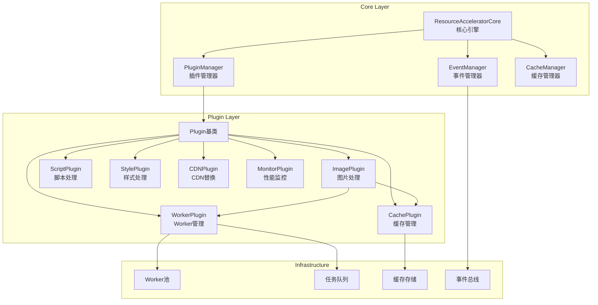
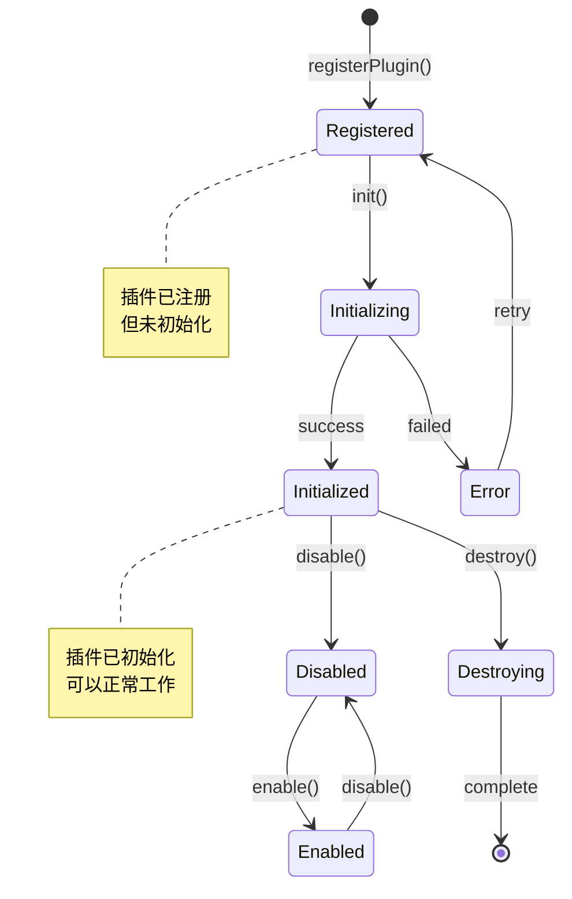
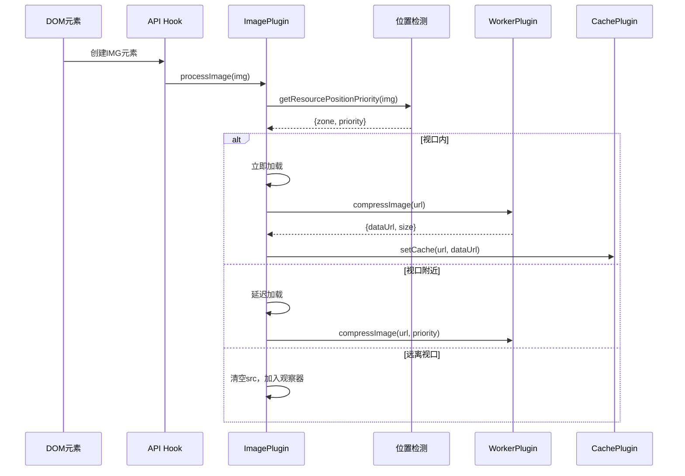
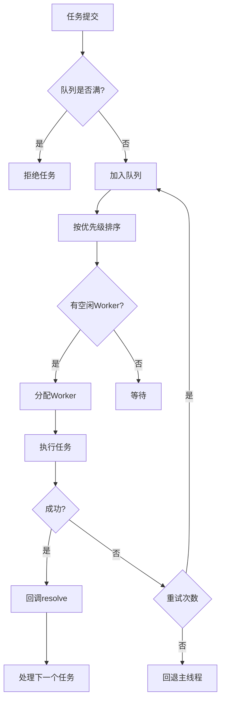
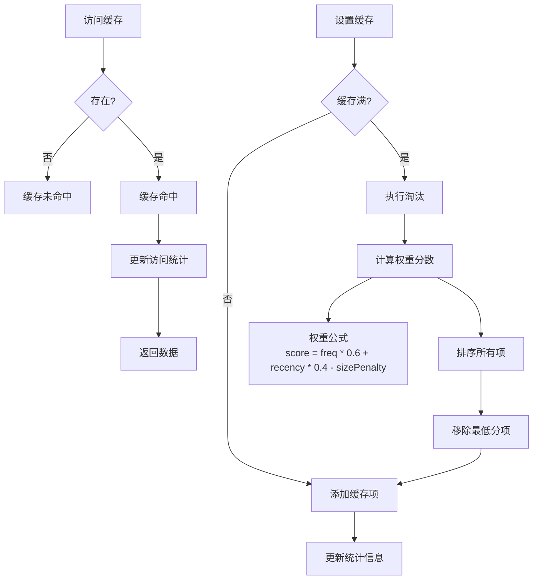
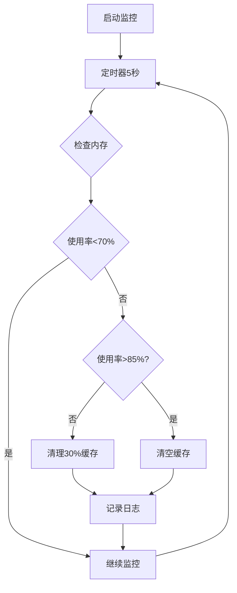
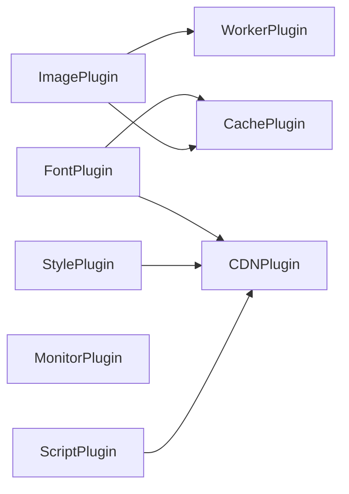
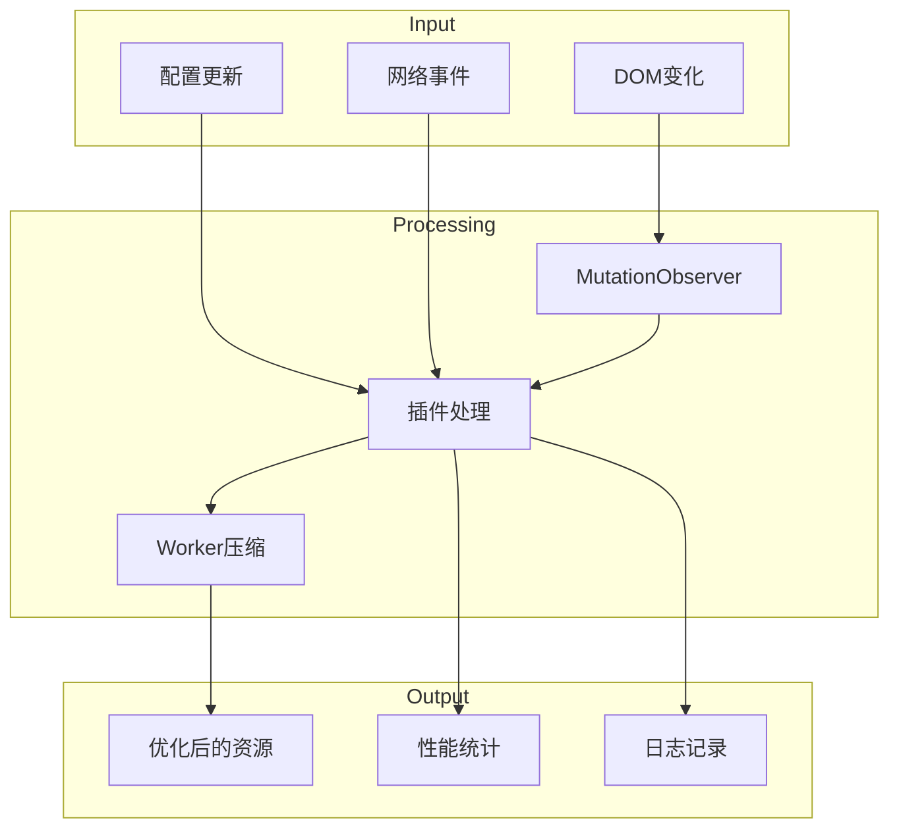

# 资源加速器架构图

## 整体架构

```mermaid
graph TB
    subgraph "Core Layer"
        Core[ResourceAcceleratorCore<br/>核心引擎]
        PM[PluginManager<br/>插件管理器]
        EM[EventManager<br/>事件管理器]
        CM[CacheManager<br/>缓存管理器]
    end

    subgraph "Plugin Layer"
        Base[Plugin基类]
        Worker[WorkerPlugin<br/>Worker管理]
        Image[ImagePlugin<br/>图片处理]
        Script[ScriptPlugin<br/>脚本处理]
        Style[StylePlugin<br/>样式处理]
        Cache[CachePlugin<br/>缓存管理]
        CDN[CDNPlugin<br/>CDN替换]
        Monitor[MonitorPlugin<br/>性能监控]
    end

    subgraph "Infrastructure"
        WorkerPool[Worker池]
        TaskQueue[任务队列]
        CacheStore[缓存存储]
        EventBus[事件总线]
    end

    Core --> PM
    Core --> EM
    Core --> CM

    PM --> Base
    Base --> Worker
    Base --> Image
    Base --> Script
    Base --> Style
    Base --> Cache
    Base --> CDN
    Base --> Monitor

    Worker --> WorkerPool
    Worker --> TaskQueue

    Image --> Cache
    Image --> Worker

    Cache --> CacheStore

    EM --> EventBus
```

## 插件生命周期

```mermaid
stateDiagram-v2
    [*] --> Registered: registerPlugin()
    Registered --> Initializing: init()
    Initializing --> Initialized: success
    Initializing --> Error: failed
    Error --> Registered: retry
    Initialized --> Disabled: disable()
    Disabled --> Enabled: enable()
    Enabled --> Disabled: disable()
    Initialized --> Destroying: destroy()
    Destroying --> [*]: complete

    note right of Registered
        插件已注册
        但未初始化
    end note

    note right of Initialized
        插件已初始化
        可以正常工作
    end note
```

## 图片处理流程

```mermaid
sequenceDiagram
    participant DOM as DOM元素
    participant Hook as API Hook
    participant Image as ImagePlugin
    participant Position as 位置检测
    participant Worker as WorkerPlugin
    participant Cache as CachePlugin

    DOM->>Hook: 创建IMG元素
    Hook->>Image: processImage(img)
    Image->>Position: getResourcePositionPriority(img)
    Position-->>Image: {zone, priority}

    alt 视口内
        Image->>Image: 立即加载
        Image->>Worker: compressImage(url)
        Worker-->>Image: {dataUrl, size}
        Image->>Cache: setCache(url, dataUrl)
    else 视口附近
        Image->>Image: 延迟加载
        Image->>Worker: compressImage(url, priority)
    else 远离视口
        Image->>Image: 清空src，加入观察器
    end
```

## Worker任务调度

```mermaid
graph TB
    Task[任务提交] --> Queue{队列是否满?}
    Queue -->|是| Reject[拒绝任务]
    Queue -->|否| Enqueue[加入队列]

    Enqueue --> Priority[按优先级排序]
    Priority --> Available{有空闲Worker?}

    Available -->|是| Assign[分配Worker]
    Available -->|否| Wait[等待]

    Assign --> Execute[执行任务]
    Execute --> Success{成功?}

    Success -->|是| Callback[回调resolve]
    Success -->|否| Retry{重试次数<N?}

    Retry -->|是| Enqueue
    Retry -->|否| Fallback[回退主线程]

    Callback --> Next[处理下一个任务]
```

## 缓存淘汰策略

```mermaid
graph TB
    Access[访问缓存] --> Check{存在?}
    Check -->|否| Miss[缓存未命中]
    Check -->|是| Hit[缓存命中]

    Hit --> Update[更新访问统计]
    Update --> Return[返回数据]

    Set[设置缓存] --> Full{缓存满?}
    Full -->|否| Add[添加缓存项]
    Full -->|是| Evict[执行淘汰]

    Evict --> Score[计算权重分数]
    Score --> Sort[排序所有项]
    Sort --> Remove[移除最低分项]
    Remove --> Add

    Add --> Stats[更新统计信息]

    Score --> Formula[权重公式<br/>score = freq * 0.6 + recency * 0.4 - sizePenalty]
```

## 内存压力监控

```mermaid
graph TB
    Start[启动监控] --> Timer[定时器5秒]
    Timer --> Check{检查内存}

    Check --> Normal{使用率<70%}
    Normal -->|是| Continue[继续监控]
    Normal -->|否| Warning{使用率>85%?}

    Warning -->|否| Reduce[清理30%缓存]
    Warning -->|是| Critical[清空缓存]

    Reduce --> Log[记录日志]
    Critical --> Log
    Log --> Continue

    Continue --> Timer
```

## 插件依赖关系

```mermaid
graph LR
    Worker[WorkerPlugin]
    Cache[CachePlugin]
    CDN[CDNPlugin]

    Image[ImagePlugin] --> Worker
    Image --> Cache

    Script[ScriptPlugin] --> CDN

    Style[StylePlugin] --> CDN

    Monitor[MonitorPlugin]

    Font[FontPlugin] --> CDN
    Font --> Cache
```

## 数据流

```mermaid
flowchart TB
    subgraph Input
        DOM[DOM变化]
        Config[配置更新]
        Network[网络事件]
    end

    subgraph Processing
        Observer[MutationObserver]
        Plugin[插件处理]
        Worker[Worker压缩]
    end

    subgraph Output
        Optimized[优化后的资源]
        Stats[性能统计]
        Logs[日志记录]
    end

    DOM --> Observer
    Config --> Plugin
    Network --> Plugin

    Observer --> Plugin
    Plugin --> Worker

    Worker --> Optimized
    Plugin --> Stats
    Plugin --> Logs
```
